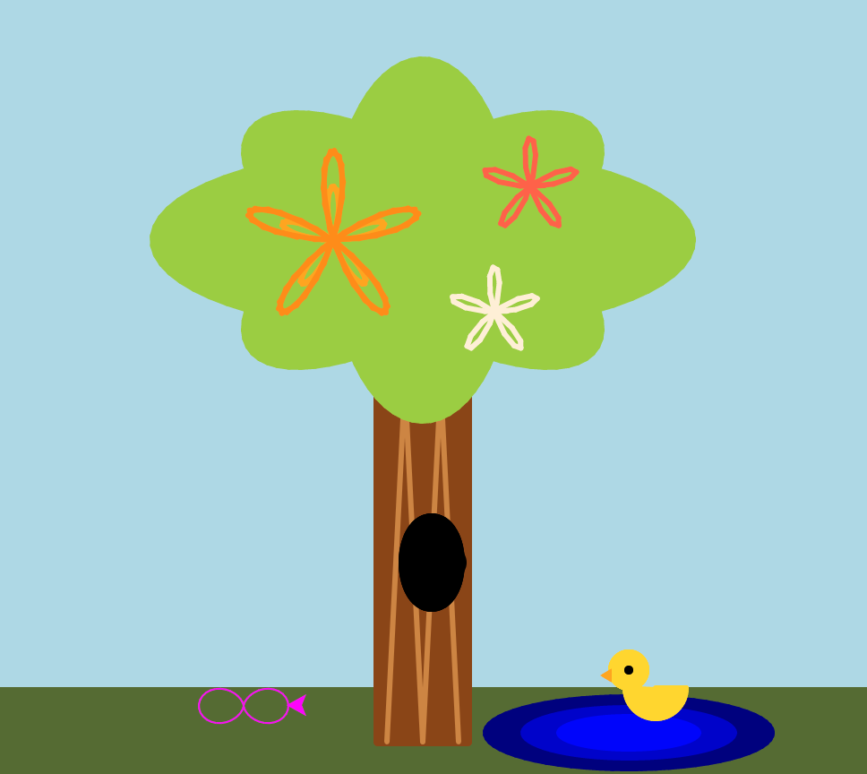
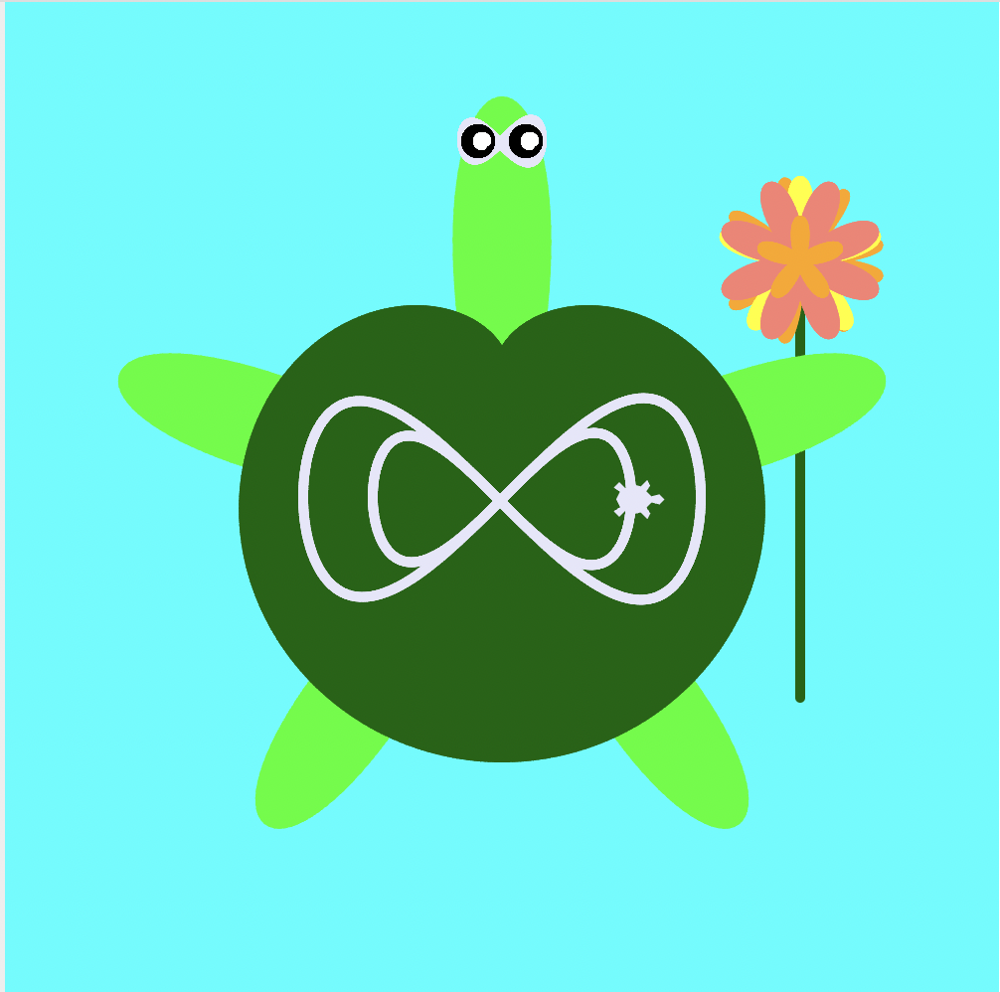
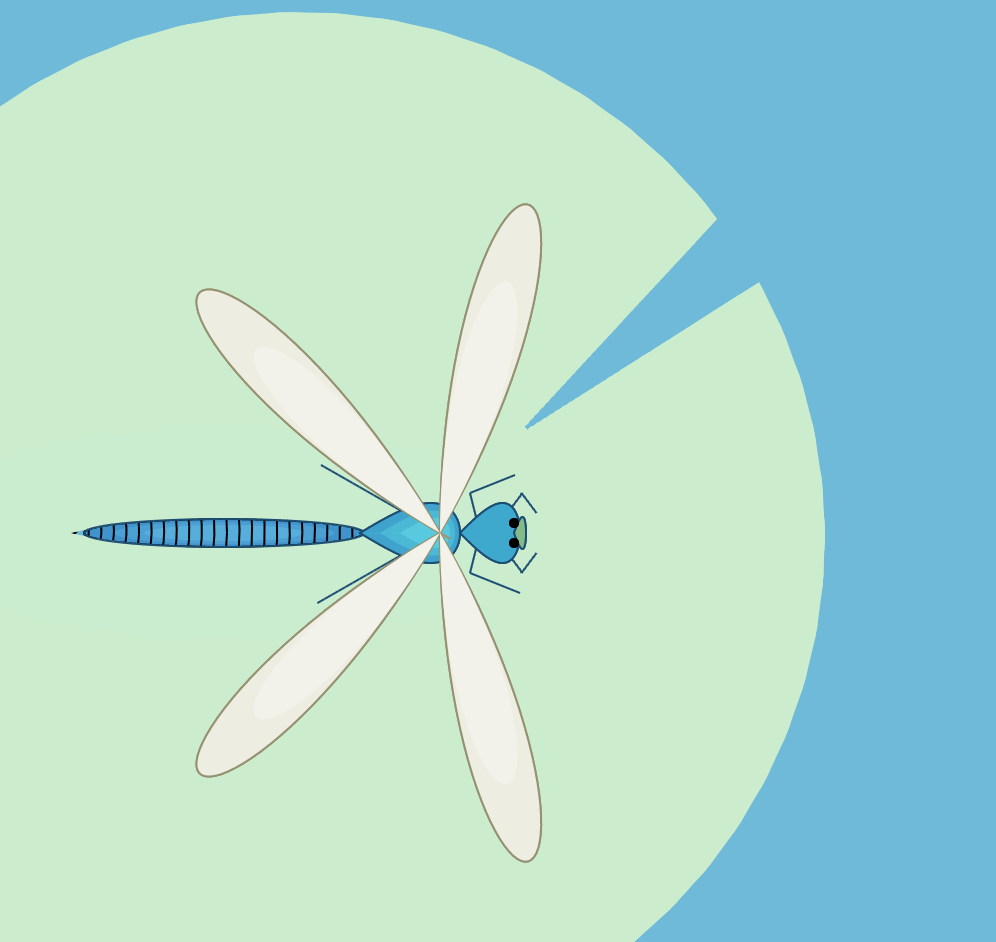
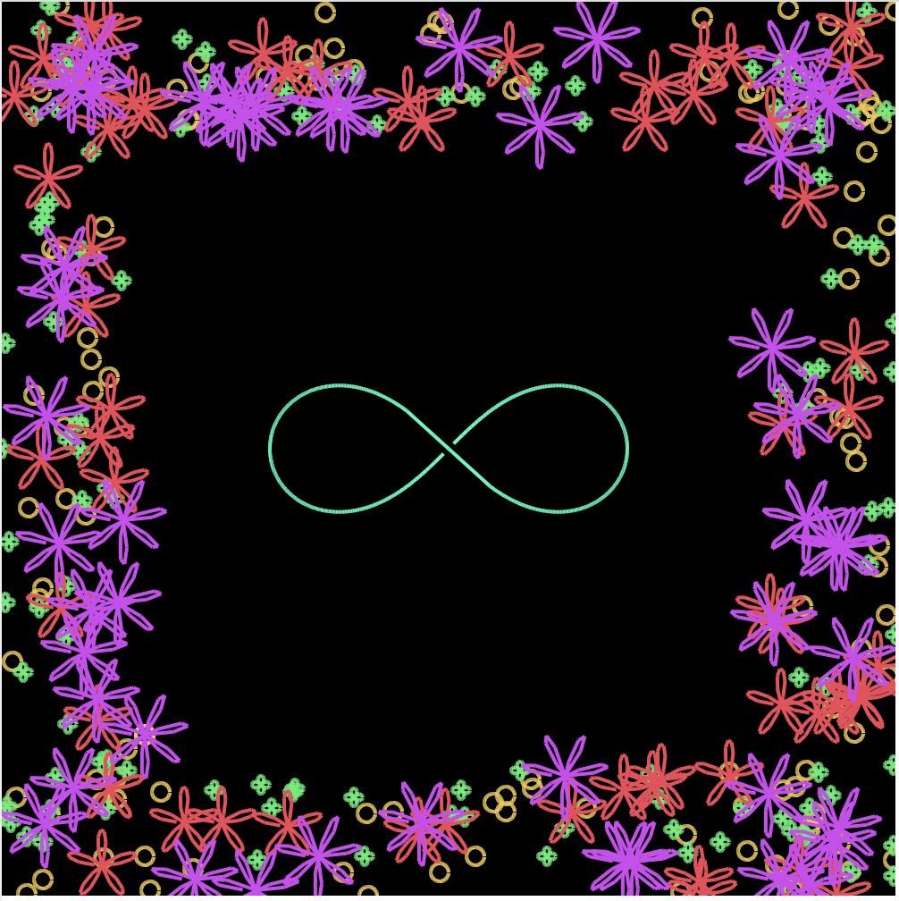

class: center, middle

# Software Playgrounds 
# in the 
# Classroom

 
 
 

.bottom[
Darren Kessner, PhD   

[http://dkessner.github.io](http://dkessner.github.io)
]

---

# About me

- Education:
    - BS, MA in Mathematics (UCLA, Princeton)
    - PhD in Bioinformatics (UCLA)

- 25 years writing software:
    - security
    - computer graphics
    - scientific applications
    - education

- Currently:
    - Program Head in Computer Science and Software Innovation at
      [Marlborough School](http://stem.marlborough.org) 
      in Los Angeles
    - Software developer at [Ellison Institute](http://eitm.org)

---

# Education History / Philosophy

Papert & Mindstorms

---

# Software Playgrounds

 

What is a software playground?

- safe sandbox for exploration

- a familiar place where a student's prior knowledge is useful

 
 

Goal of this presentation:

- to give an overview of the landscape of educational / creative coding  

- to help you generate some ideas for your own software playground

---

# Python

 

Python is a great for math lessons at all levels!

 

Pre-algebra/algebra

- order of operations
- variables and formulas
- functions

 

Precalculus

- sequences and series
- parametric equations (turtle graphics)

 

[Hello Jupyterlite!](https://dkessner.github.io/hello_jupyterlite)

---

# Turtle + parametric equations

.center[
 

]

---

# Processing

[Processing](https://processing.org) is one big playground,
suitable for students as early as middle school.

Drawing & animating with code:

- coordinate system
- RGB colors
- variables
- conditions
- functions
- loops

Intermediate:

- classes & objects
- array, ArrayList
- user interaction
- collision detection

---

# Processing advanced projects

 

- 3D graphics
    - textures
    - 3D model import

- video

- image filtering

- audio input and visualization

- Kinect sensor

---

# p5.js

 

Processing on the web

 

[p5js.org](https://p5js.org)

 

[p5.js online IDE](https://editor.p5js.org/)

 

[Teachable Machine](https://teachablemachine.withgoogle.com)

---

# p5.js embedded playgrounds

 

[Hour of Code website](https://dkessner.github.io/ProjectPumpkin)

 

[Parametric Playground](https://dkessner.github.io/ParametricPlayground)

---

# Thank you

[http://dkessner.github.io](http://dkessner.github.io)

